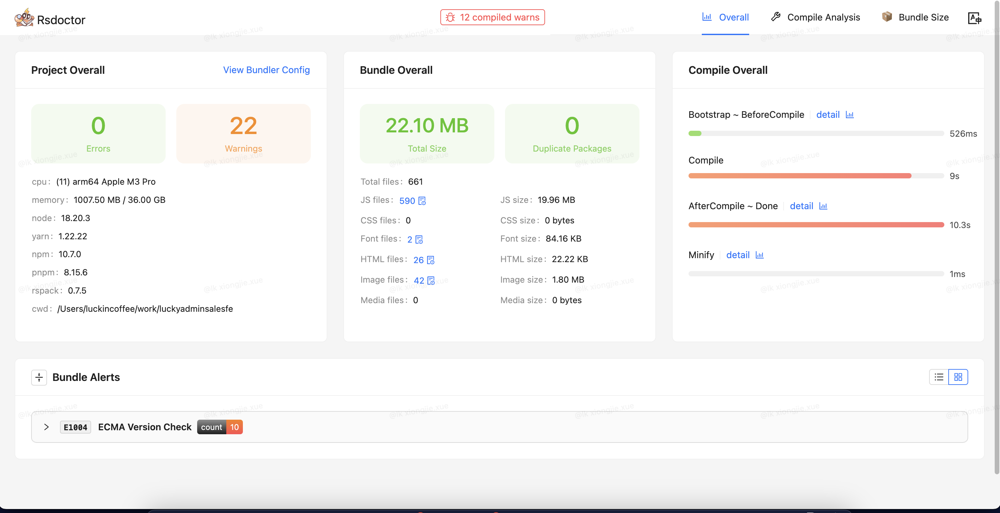

# 基于 Rspack 的构建能力升级实施方案

## 背景

随着公司业务的发展，现有的基于 Webpack4 版本的 CLI 工具在处理 Vue2多页应用 时出现了明显的性能瓶颈，导致打包时间过长，影响日常开发测试效率。

## 技术选型

| 维度              | Rspack             | Webpack           | Vite              | Esbuild           | Turbopack         | Rollup            | Parcel            |
|------------------|--------------------|-------------------|-------------------|--------------------|-------------------|-------------------|-------------------|
| 开发语言          | Rust               | JavaScript        | TypeScript (ESM)  | Go                 | Rust              | JavaScript        | JavaScript        |
| 生态系统成熟度    | 新兴 ❌            | 非常成熟 ✅       | 中等 ✅            | 中等 ✅             | 新兴 ❌            | 成熟 ✅            | 一般 ❌            |
| 配置灵活度        | 高 ✅              | 非常高 ✅         | 中等 ✅            | 低 ❌              | 高 ✅              | 中等 ✅            | 低 ❌              |
| *HMR性能         | 极快 ✅            | 快 ✅             | 极快 ✅            | 较差 ❌            | 快 ✅              | 较差 ❌            | 快 ✅              |
| *构建速度         | 极快 ✅            | 中等 ❌          | 极快 ✅            | 极快 ✅             | 快 ✅              | 快 ✅              | 快 ✅              |
| *打包体积         | 较小 ✅            | 中等 ❌          | 较小 ✅            | 较小 ✅             | 较小 ✅            | 很小 ✅            | 较小 ✅            |
| *兼容性           | 良好 ✅            | 非常好 ✅         | 良好 ❌（与 CommonJS 模块不完全兼容） | 良好 ✅          | 良好 ✅            | 良好 ✅            | 良好 ✅            |
| 使用场景          | 打包应用 ✅        | 打包应用 ✅       | 应用和库 ✅       | 应用和库 ✅        | 应用和库 ✅        | 打包库❌           | 打包应用 ✅        |
| *迁移成本         | 较低 ✅            | 低 ✅             | 大 ❌             | 较大 ❌            | 大 ❌              | 中等 ✅            | 低 ✅              |

综合以上维度，Rspack在性能、配置灵活度和兼容性方面都有较好的表现。考虑到未来的发展潜力和性能优势，选择Rspack是一个明智的选择。特别是对于从Webpack 4迁移的老项目，Rspack提供了很好的迁移路径和支持，可以在保证性能的同时逐步完成迁移。

## 实施步骤

- 将现有 Webpack4 配置逐步迁移到 Rspack。
- 利用 Rspack 的特性优化打包流程，例如动态导入、Tree Shaking等。
- 集成Vue.js官方支持，确保与前端框架兼容。
- 接入部署 CI 流程，确定Node版本，优化 shell 脚本，提高构建效率。

## Rspack 工具架构图


1. **第一个阶段是 make 阶段，主要分析项目依赖，然后生成一个模块依赖图；**
2. **第二个阶段 seal 阶段，主要是做代码产物优化以及最终产物生成。**
    - 产物优化主要包括 tree-shaking 和 bundle-splitting, code-splitting 以及 minify。

    - tree-shaking 使用类似垃圾回收 mark-sweep 算法，遍历所有可能被执行的代码，将所有不会被执行的代码删除。

    - code-splitting 通过重新将模块进行组合，使用一些策略将其分割生成若干 chunk，最终达到更快速的浏览器加载，更高的 CDN 缓存命中率。

## 实施步骤

### 安装Rspack

```bash
npm i @rspack/core @rspack/cli -D
```

移除项目中 webpack 相关的依赖

```bash
npm uninstall webpack webpack-cli webpack-dev-server
```

### 修改 package.json

```json
{
  "scripts": {
    -   "dll": "npx webpack --config ./build/webpack.dll.js",
    -   "spa": "npm run dll && npx webpack server --env platform=advertise --config ./build/webpack.dev.js",
    -   "spas": "npm run dll && npx webpack server --config ./build/webpack.dev.js",
    -   "build:client": "npm run dll && npx webpack --config ./build/webpack.prod.js",
    +   "spa": "PLATFORM=XXX npm run spas",
    +   "spas": "rspack serve --config ./build/rspack.dev.js",
    +   "build:client": "rspack build --config ./build/rspack.prod.js",
    +   "doctor": "RSDOCTOR=true npm run build",
  }
}
```

### 修改配置文件

将 build 文件夹下的

- webpack.base.js → rspack.base.js
- webpack.dev.js → rspack.dev.js
- webpack.prod.js → rspack.prod.js

然后通过 `-c` 或 `--config` 指定配置文件。

### 插件替换

1. **copy-webpack-plugin → rspack.CopyRspackPlugin：**

build/rspack.prod.js

```js
- const CopyWebpackPlugin = require('copy-webpack-plugin');
+ const { CopyRspackPlugin } = require('@rspack/core');
const { PUBLIC_PATH, CLIENT_PUBLIC_PATH } = require('./utils/path');

module.exports = {
  plugins: [
    -   new CopyWebpackPlugin({
    +   new CopyRspackPlugin({
        [
          {
            from: CLIENT_PUBLIC_PATH,
            to: PUBLIC_PATH
          }
        ],
        {
          copyUnmodified: true
        }
      }),
    ],
}
```

2. **html-webpack-plugin → rspack.HtmlRspackPlugin**

build/rspack.base.js

```js
- const HtmlWebpackPlugin = require('html-webpack-plugin');
+ const { HtmlRspackPlugin } = require('@rspack/core');
const { appConfigs } = require('./utils/appConfigs');

module.exports = {
  plugins: [
    ...appConfigs.map((app) => {
      -      return new HtmlWebpackPlugin(app.htmlWebpackPlugin);
      +      return new HtmlRspackPlugin(app.htmlWebpackPlugin);
    }),
  ]
}
```

### Loader替换

file-loader / url-loader / raw-loader → 资源模块。
Rspack 实现了 webpack 5 的资源模块，使用资源模块来代替 file-loader、url-loader 和 raw-loader 以达到最佳的性能。

1. **file-loader → asset/resource**

build/rspack.base.js

```js
module.exports = {
   module: {
     rules: [
       {
         test: [
          /\.bmp$/,
          /\.gif$/,
          /\.jpe?g$/,
          /\.png$/,
          /\.eot$/,
          /\.ttf/,
          /\.woff/,
          /\.svg/,
          /\.woff2/
        ],
-        use: ["file-loader"],
+        type: "asset/resource",
       },
     ],
   },
};
```

2. **url-loader → asset/inline**

build/rspack.base.js

```js
module.exports = {
   module: {
     rules: [
       {
         test: /webfonts.*\.svg$/,
-        use: ["url-loader"],
+        type: "asset/inline",
       },
       {
         test: /\.svga$/i,
-        use: ["url-loader"],
+        type: "asset/inline",
       },
     ],
   },
};
```

3. **vue-loader 之 Vue2 兼容**

确保在配置 Vue2 项目时关闭 `experiments.css` 或在 `CSS` 相关的规则中使用 `Rule.type = "javascript/auto"`

build/rspack.base.js

```js
module.exports = {
  experiments: {
    css: false,
  },
  module: {
    rules: [
     {
        test: /\.vue$/,
        include: [SPA_PATH, path.resolve(__dirname, '../node_modules/element-ui')],
        use: {
          loader: 'vue-loader',
          options: {
            compilerOptions: {
              whitespace: 'condense'
            },
            experimentalInlineMatchResource: true,
          }
        },
        type: 'javascript/auto',
      },
    ],
  },
};
```

## 构建优化

### Rsdoctor包分析

1. **安装 `rsdoctor`**

```bash
npm i @rsdoctor/rspack-plugin -D
```

2. **在 rspack.base.js 的 plugins 中初始化 RsdoctorRspackPlugin 插件：**

```js
// rspack.base.js
const { RsdoctorRspackPlugin } = require('@rsdoctor/rspack-plugin');

module.exports = {
  // ...
  plugins: [
    // 仅在 RSDOCTOR 为 true 时注册插件，因为插件会增加构建耗时
    process.env.RSDOCTOR && new RsdoctorRspackPlugin({
      port: 8023,
      features: ['loader', 'plugins', 'bundle']
    }),
  ].filter(Boolean),
};
```

3. **在构建命令之前添加 RSDOCTOR=true 变量：**

```json
  "build": "cross-env NODE_OPTIONS=\"--max-old-space-size=8192\" npm run build:client",
+ "doctor": "RSDOCTOR=true npm run build",
```

4. **发现存在一个依赖包重复引入问题，通过配置 `resolve.alias` 解决：**


```js
// rspack.base.js
module.exports = {
  resolve: {
    alias: {
      'async-validator': path.resolve(__dirname, '../node_modules/async-validator')
    }
  }
};
```

### 代码分割

SplitChunksPlugin

Rspack 默认会对 node_modules 目录下的文件以及重复模块进行拆分，将这些模块从他们所属的原 Chunk 抽离到单独的新 Chunk 中。通过合适设置 optimization.splitChunks.cacheGroups.{cacheGroup} 抽离 Chunk。

不设置 cacheGroups，未细化 Chunk 的结果：



配置 cacheGroups：

```js
// rspack.prod.js
module.exports = {
  optimization: {
    providedExports: true, // 包括重导出模块，引用模块不存在的导出时会发出提示
    usedExports: true, // 未使用的导出内容不会被生成
    removeEmptyChunks: true, // 移除空的 chunk
    minimize: true,
    mergeDuplicateChunks: true, // 合并含有相同模块的 chunk
    chunkIds: 'deterministic', // 简短的数字 id,适合长期缓存
    moduleIds: 'deterministic', // 使用对模块标识符哈希后的数字当作模块 id，有益于长期缓存
    // 内置压缩工具
    minimizer: [
      new SwcJsMinimizerRspackPlugin(),
      new LightningCssMinimizerRspackPlugin(),
    ],
    // 分割代码块
    splitChunks: {
      chunks: 'all', // 异步和非异步 chunk 之间共享
      minChunks: 1,
      minSize: 20000,
      maxAsyncRequests: 30,
      maxInitialRequests: 30,
      cacheGroups: genSplitChunksCacheGroups(appConfigs)
    }
  }
};
```

```js
// utils/index.js
/**
 * @description: 生成splitChunks.cacheGroup配置
 * @param {*} appConfigs: 开发目录
 *  priority: 优先级 - 数字越大优先级越高，因为默认值为0，所以自定义的一般是负数形式
 *  reuseExistingChunk: 主bundle复用拆出来的当前bundle - 当前的chunk如果包含了从main里面分离出来的模块，则重用这个模块，这样的问题是会影响chunk的名称
 *  enforce: 始终为该缓存组创建chunk
 */
const genSplitChunksCacheGroups = (appConfigs) => {
  // 合理设置name强制拆分某些模块对构建的优缺点：重复chunk可提高缓存命中率;缺点：如果只是使用了chunk中一个小小的功能也需要引入整个chunk
  const cacheGroups = {
    // 第三方模块
    defaultVendors: {
      test: /[\\/]node_modules[\\/]/,
      priority: -10,
      minSize: 1024 * 30, // 大于 30kb才抽离
      reuseExistingChunk: true,
    },
    // 三者版本不兼容时在同一个chunk，导致运行时报错TypeError: Cannot read properties of null (reading 'install') - vue.runtime.esm.js
    // 单独处理 Vue
    Vue: {
      name: 'chunk-vue',
      test: /[\\/]node_modules[\\/]vue[\\/]/,
      priority: 99,
      reuseExistingChunk: true,
      enforce: true // 始终为该缓存组创建chunk
    },
    // 单独处理Vue Router
    VueRouter: {
      name: 'chunk-vue-router',
      test: /[\\/]node_modules[\\/]vue-router[\\/]/,
      priority: 99,
      reuseExistingChunk: true,
      enforce: true // 始终为该缓存组创建chunk
    },
    // 单独处理Vuex
    Vuex: {
      name: 'chunk-vuex',
      test: /[\\/]node_modules[\\/]vuex[\\/]/,
      priority: 99,
      reuseExistingChunk: true,
      enforce: true // 始终为该缓存组创建chunk
    },
    Axios: {
      name: 'chunk-axios',
      test: /[\\/]node_modules[\\/](axios|qs)[\\/]/,
      priority: 4,
      reuseExistingChunk: true,
      enforce: true // 始终为该缓存组创建chunk
    },
    lodash: {
      name: 'chunk-lodash',
      test: /[\\/]node_modules[\\/]lodash[\\/]/,
      priority: 5,
      minChunks: 2,
      reuseExistingChunk: true,
    },
    Xlsx: {
      name: 'chunk-xlsx',
      test: /[\\/]node_modules[\\/]xlsx[\\/]/,
      priority: 6,
      minChunks: 2,
      reuseExistingChunk: true,
      enforce: true, // 始终为该缓存组创建chunk
    },
    VueComponent: {
      name: 'chunk-vue-component',
      test: /[\\/]node_modules[\\/](vue\-grid\-layout|vue\-quill\-editor|async\-validator|lottie\-web)[\\/]/,
      priority: 7,
      reuseExistingChunk: true,
    },
    styles: {
      name: 'chunk-styles',
      test: /\.css$/,
      chunks: 'all',
      enforce: true
    },
    // 它通常包含的是项目内部共享的代码，这些代码可能更频繁地发生变化，因此没有必要也不推荐为它们设置固定的name，以避免缓存问题
    default: {
      minChunks: 2,
      priority: -20,
      reuseExistingChunk: true
    }
  };
  // 单独提取每个client/spa应用的三方依赖
  if (Array.isArray(appConfigs)) {
    appConfigs.forEach((app) => {
      cacheGroups[app.name] = {
        chunks: 'all',
        name: `${app.name}/vendors`,
        // 模块路径匹配这个正则的才满足提取
        test: /[\\/]node_modules[\\/]/,
        priority: -30,
        reuseExistingChunk: true // 主bundle复用拆出来的当前bundle
      };
    });
  }

  return cacheGroups;
};
```

需要注意的是合理设置 optimization.splitChunks.cacheGroups.{cacheGroup}.name 强制拆分某些模块对构建的影响：

- 优点：重复 Chunk 可提高缓存命中率;
- 缺点：如果只是使用了 Chunk 中一个小小的功能也需要引入整个 Chunk


当 `Chunk` 体积很小，如果让浏览器加载——造成了较大的 `HTTP` 开销。`LimitChunkCountPlugin` 可以在处理完毕后通过合并它们来优 Chunk。

```js
// rspack.prod.js
const { optimize } = require('@rspack/core');
module.exports = {
  plugins: [
    //  chunk 太小——造成了较大的 HTTP 开销,合并它们来优化你的 chunk
    new optimize.LimitChunkCountPlugin({
      maxChunks: 5,
    })
  ],
};
```

使用该插件后，会让未加 `scoped` 的 `css` 被合并并提取成全局样式（其实这是符合预期的）。如果改造过程中存在大量 `css` 差异问题可以先注释掉，后面成立 `css治理专项` 统一处理完再开启。

### 指定babel的"target"对于构建的影响

排查发现，在构建时，`babel-loader` 读取了我的 `.babelrc`，因此这些代码被降级到更低的版本，导致为 `async iterators` 等功能生成了很多样板代码。

```js
// .babelrc
[
  "@babel/preset-env",
  {
    "modules": false,
    "targets":  "defaults"
  }
]
```


## 生产优化

### 源码映射

我在开发环境配置了 `eval-cheap-module-source-map`，原因是：`vue-loader` 转化后的源码差别大，需要调试 `Loader` 转化前的源代码，一般源代码只需要定位到列即可，省略列提升构建速度。

生产环境关闭了 SourceMap。`SourceMap` 会带来一定的性能开销，特别是在项目较大的情况，如果非在线上调试，我的建议选择安全且性能较好的配置，如：

```js
// rspack.prod.js
module.exports = {
   devtool: 'nosources-source-map',
};
```

这样出现错误可以定位到源代码位置，而至于暴露源代码，当然这不是绝对的，我们应该要寻找合适的模式，而不是寻求一个通用法则。

### 代码压缩

在执行生产构建时，`Rspack` 默认使用内置的压缩器对 `JavaScript` 和 `CSS` 代码进行压缩，你可以使用 `SwcJsMinimizerRspackPlugin` 和 `LightningCssMinimizerRspackPlugin` 来进行配置。

```js
// rspack.prod.js
module.exports = {
  optimization: {
    minimizer: [
      new SwcJsMinimizerRspackPlugin({
        // JS minimizer 配置
      }),
      new LightningCssMinimizerRspackPlugin({
        // CSS minimizer 配置
      }),
    ],
  }
};
```

### 开启 cache

- 该选项可以开启或者关闭 `Rspack` 构建过程中对快照及中间产物的缓存（内存缓存，持久化缓存正在规划中），如果开启，在下次构建中可以使用它们来提升构建的速度;
- `babel-loader` 也可以开启 `cache` 缓存。

```js
// rspack.prod.js
module.exports = {
  module: {
    // 缓存中间产物的缓存，来改善构建速度
    cache: true,
    rules: [
      {
        test: [/\.js$/],
        include: SPA_PATH,
        use: {
            loader: 'babel-loader',
            options: {
              cacheDirectory: true,
              // cacheDirectory: path.resolve(CACHE_PATH, './babel-loader'), // 自定义缓存目录
              cacheCompression: true, // gzip cache
            },
        }
      },
    ]
  }
};
```

### 分环境处理样式css、less

1. **开发环境使用 `vue-style-loader` 提高 `HMR` 编译效率**

```js
// rspack.dev.js
module: {
  rules: [
    {
      test: /\.(css|less)$/i,
      use: [
        'vue-style-loader', // 开发环境使用vue-style-loader提高HMR编译效率
        'css-loader',
        'less-loader',
      ],
      type: 'javascript/auto',
    },
  ]
}
```

2. **生产环境使用 `css-extract-plugin` 抽离 `css` 提高缓存利用 + 首屏加载优化 + 代码分割**

```js
// rspack.prod.js

const { CssExtractRspackPlugin } = require('@rspack/core');

...
module: {
    rules: [
      {
        test: /\.(css|less)$/i,
        use: [
          CssExtractRspackPlugin.loader, // 生产环境使用css-extract-plugin抽离css提高缓存利用+首屏加载优化+代码分割
          'css-loader',
          // builtin:lightningcss-loader 替代post-css可以提高编译速度，但是由于不兼容/deep/语法，需要改动文件较多暂时不改
          'less-loader',
        ],
        type: 'javascript/auto',
      },
    ]
  },
plugins: [
    new CssExtractRspackPlugin({
      filename: '[name]/[contenthash:8].css', // 主css文件
      chunkFilename: '[name]/[contenthash:8].chunk.css' // 动态生成的 css 文件或者代码分割产生的 css 文件
    }),
]
...
```

### 分环境处理 `{optimization.chunkIds}` 和 `{optimization.moduleIds}`

```js
// rspack.prod.js
optimization: {
    providedExports: true, // 包括重导出模块，引用模块不存在的导出时会发出提示
    usedExports: true, // 未使用的导出内容不会被生成
    concatenateModules: true, // 开启模块拼接优化，允许将多个模块拼接成单个模块以降低产物体积，提升压缩效率
    removeEmptyChunks: true, // 移除空的 chunk
    realContentHash: true, // 在产物处理完成后，添加额外的哈希计算步骤根据产物的文件内容计算该产物的哈希
    mergeDuplicateChunks: true, // 合并含有相同模块的 chunk
    chunkIds: 'deterministic', // 简短的数字 id,适合长期缓存
    moduleIds: 'deterministic', // 使用对模块标识符哈希后的数字当作模块 id，有益于长期缓存
    // 内置压缩工具
    runtimeChunk: 'multiple', // 每个入口点添加一个仅包含运行时的额外 chunk
    minimize: true, // 是否对产物进行压缩
}
```

```js
// rspack.dev.js
optimization: {
  sideEffects: false,
  chunkIds: 'named',// 有意义、方便调试的内容当作 Chunk id
  moduleIds: 'named', // 有意义、方便调试的内容当作 Module id
  minimize: false
}
```

### `{optimization.runtimeChunk}` 为每个入口点添加一个仅包含运行时的额外 `chunk`

```js
// rspack.prod.js
optimization: {
    ...
    runtimeChunk: 'multiple', // 每个入口点添加一个仅包含运行时的额外 chunk
}
```

## 番外

### `mpa` 多页应用如果支持改造成单 `spa` 启动项目提高开发编译速度？

1. **设置动态 `entry` 来支持 `spa` 入口构建**

```js
// rspack.dev.js
const { getDevEntry } = require('./utils/index');

module.exports = {
  entry: getDevEntry(appConfigs, spaName),
};
```

```js
// utils/index.js
/**
 * @description: 生成单个spa入口
 * @param {*} appConfigs:
 * @param {*} spaName:
 * @returns {*}
 */
const getSimpleEntry = (appConfigs, spaName) => {
  if (!spaName) throw new Error('spaName is required');

  const app = appConfigs.find((app) => app.name === spaName);
  if (!app) throw new Error(`spas下找不到: ${spaName}`);
  return { [spaName]: app.entryFile };
};


/**
 * @description: dev模式根据platform启动所有spa还是单个spa
 * @param {*} appConfigs:
 * @param {*} spaName:
 * @returns {*}
 */
const getDevEntry = (appConfigs, spaName) => {
  if (!spaName) return getEntry(appConfigs);

  return getSimpleEntry(appConfigs, spaName);
};
```

2. **动态设置 `devServer.open` 自动打开页面**

```js
// rspack.dev.js
const { getSpaOpenPage } = require('./utils/index');

module.exports = {
  devServer: {
      ...
      open: getSpaOpenPage(spaName),
      historyApiFallback: {
        rewrites: [
          ...getRewrites(appConfigs),
          { from: '/', to: `/${spaName ?? defaultAppName}/index.html` }
        ]
      },
  }
};
```

```js
// utils/index.js
/**
 * @description: 根据第一个路由文件下的path生成单spa启动配置open页面
 * @param {String} spaName:
 * @returns {*} open
 */
const getSpaOpenPage = (spaName) => {
  try {
    if (spaName) {
      const folderPath = path.join(APP_PATH, `./${spaName}/router/modules`);
      // 读取文件夹中的所有文件
      const files = fs.readdirSync(folderPath);
      // 找到第一个 .js 文件
      const jsFile = files.find(file => path.extname(file) === '.js');

      if (!jsFile) {
        console.log('No .js file found in the directory.');
        return;
      }
      // 构建完整的文件路径
      const filePath = path.join(folderPath, jsFile);
      // 读取文件内容
      const data = fs.readFileSync(filePath, {
        encoding: 'utf-8'
      })?.replace('export default', 'module.exports ='); // es=>commonjs

      // 将文件内容解析为 JavaScript 对象
      // 创建一个新的沙箱环境来执行文件中的代码
      const sandbox = {
        module: {}, // 添加 module 对象
        exports: {} // 添加 exports 对象
      };

      // 使用 vm 模块执行文件中的代码
      vm.runInNewContext(data, sandbox, filePath);
      // 获取导出的对象
      const routes = sandbox.module.exports || sandbox.exports;
      // 获取第一个对象的 path 值
      const firstPath = routes[0]?.path;
      return [`/${spaName}${firstPath}`]; // 配置启动单个spa时候，打开对应的路由第一个配置页
    }
  } catch (error) {
    console.log('GetSpaOpenPage Error：' + error);
  }
};
```

3. **在构建命令之前添加 `PLATFORM=xx` 变量：**

```json
+   "spa": "PLATFORM=advertise npm run spas",
```

在多页巨石应用上效果明显，本地启动速度从 `10+s` 提升到了 `2s` 内，热更新速度提升到`毫秒`级别

4. **`appConfigs` 依赖系统本身的目录结构，可参考，但不能照搬！**

如我们的目录结构是：client/spa/apps/下面对应spa应用

```js
// utils/appConfigs.js
'use static';

const fs = require('fs');
const path = require('path');
const { APP_PATH } = require('./path');

/**
 * @description: 根据目录结构获取所有子应用
 * @param {*} type:
 * @returns {*}
 */
const getAppNames = (type) => {
  const appDir = APP_PATH;
  if (fs.existsSync(appDir)) {
    return fs
      .readdirSync(appDir)
      .filter((dir) => {
        return fs.lstatSync(path.join(appDir, dir)).isDirectory();
      })
      .map((name) => `${type}.${name}`);
  }
  return [];
};

/**
 * @description: 生成{meta, type, name}结构
 * @param {*} name:
 * @returns {*}
 */
const genName = (name) => ({
  meta: name,
  type: name.split('.')[0],
  name: name.split('.')[1]
});

/**
 * @description: 生成{dir,...o}
 * @param {*} o:
 * @returns {*}
 */
const genDir = (o) => {
  let dir;
  if (o.meta.startsWith('spa.')) {
    dir = path.resolve(APP_PATH, o.name);
  }

  return {
    dir,
    ...o
  };
};

/**
 * @description: 生成{entryFile,...o}
 * @param {*} o:
 * @returns {*}
 */
const genEntryFile = (o) => {
  const jsPath = path.join(o.dir, 'index.js');
  const jsxPath = path.join(o.dir, 'index.jsx');
  const entryFile =
    (fs.existsSync(jsPath) && jsPath) ||
    (fs.existsSync(jsxPath) && jsxPath);

  return {
    entryFile,
    ...o
  };
};

/**
 * @description: 生成{htmlWebpackPlugin,...o}
 * @param {*} app:
 * @returns {*}
 */
const genHtmlWebpackPluginConfig = (app) => ({
  htmlWebpackPlugin: {
    // 设置chunks，则只会单独引入 app.name 的js
    chunks: [app.name],
    filename: `${app.name}/index.html`,
    template: `${app.dir}/index.html`,
    minify: true
  },
  ...app
});

const appConfigs =
  getAppNames('spa')
    .map(genName)
    .map(genDir)
    .map(genEntryFile)
    .map(genHtmlWebpackPluginConfig);

module.exports = {
  appConfigs
};

```

### 构建shell脚本优化，加快 CI 速度

```sh
#!/bin/bash -e
# root
# 定义环境变量
env=$1
skip=$2
export PATH=$PATH:/usr/local/nodejs/bin:/usr/sbin

# 输出构建开始信息
echo "[build][Start]..."

# 导航到项目根目录
cd ..

PROJECT_ROOT=$(pwd)
PROJECT_NAME="${PROJECT_ROOT##*/}"
cd ..
NODE_ROOT=$(pwd)
LOG_ROOT=$NODE_ROOT/logs/$PROJECT_NAME
REGISTRY="https://内网地址" # 如有

echo "[build][step 0] echo something..."
echo "PROJECT_NAME: ${PROJECT_NAME}"
echo "PROJECT_ROOT: ${PROJECT_ROOT}"
echo "NODE_ROOT: ${NODE_ROOT}"
echo "LOG_ROOT: ${LOG_ROOT}"
echo "Run env: ${env}"
echo 'user: '`whoami`
echo 'npm -v:'`npm -v`
echo 'node -v:'`node -v`

# 检查环境变量
if [ -z "$env" ];
  then
    echo "[build][Error] the build.sh need a environment argument"
    echo "[build][Maybe] the argument must be one of them [ local / test / test2 / test3 / test4 / pre / prod ]"
    exit 1
fi

# 日志文件
NPMLOGFILE="${PROJECT_NAME}.npm.log"
BUILDLOGFILE="${PROJECT_NAME}.npm.build.log"

# 清除旧的日志文件
rm -f "${NPMLOGFILE}" "${BUILDLOGFILE}"

cd $PROJECT_ROOT
# 本地测试build时 有时候需要不想要npm install, 只想验证下整个build.sh 是否正常,此时可以传skip参数.
if [ "$skip" != "skip" ];
  then
    # 开始安装依赖
    echo "[build][step 1] ##### npm install start ######"
    echo "[build][step 1] npm install --no-progress --registry=${REGISTRY}"
    echo "[build][step 1] NPMLOGFILE=${NPMLOGFILE}"
    npm install --no-progress --registry=${REGISTRY} >& ${NPMLOGFILE}

    # 检查错误
    # NPMERRCOUNT=$(grep -c 'npm\sERR' ${NPMLOGFILE} 2>/dev/null || true) # 为了部分设备防止直接输出 0 而导致脚本终止时可启用，CI上禁用
    NPMERRCOUNT=`grep -c 'npm\sERR' ${NPMLOGFILE}`
    echo "[build][step 2] npm install error count=$NPMERRCOUNT"
    # 判断是否含有npm ERR,如果有
    if [ "$NPMERRCOUNT" -gt 0 ];
      then
        # 将日志输出，方便usop上查看日志
        echo "[build][step 2] $(cat ${NPMLOGFILE})"

        # 首次安装失败，清理缓存
        echo "[build][step 2] npm install error, so npm cache clean --force"
        npm cache clean --force || { echo -e "\033[1;31m[ERROR] npm clean Failure!! \033[0m";exit 1; }

        # 再次尝试安装依赖
        echo "[build][step 2] retry npm install --no-progress --registry=$REGISTRY"
        npm install --no-progress --registry="$REGISTRY" >& "${NPMLOGFILE}"
        # NPMERRCOUNT=$(grep -c 'npm\sERR' ${NPMLOGFILE} 2>/dev/null || true) # 为了部分设备防止直接输出 0 而导致脚本终止时可启用，CI上禁用
        NPMERRCOUNT=`grep -c 'npm\sERR' ${NPMLOGFILE}`
        # 再次检查错误
        if [ "$NPMERRCOUNT" -gt 0 ];
          then
            echo "[build][step 2] $(cat "${NPMLOGFILE}")"
            rm -f "${NPMLOGFILE}"
            exit 1
        fi
    fi
    # 将日志输出，方便usop上查看日志，即使没有错误
    echo "[build][step 2] $(cat ${NPMLOGFILE})"
fi
echo "[build][step 2] ##### npm install end ######"


# 设置 NODE_ENV 为 production
export NODE_ENV="production"

echo "NODE_ENV: ${NODE_ENV}"

# 构建项目
echo "[build][step 3] npm run build"
NODE_OPTIONS=--max-old-space-size=10240 npm run build >& ${BUILDLOGFILE}

# 检查构建错误
# BUILDERRCOUNT=$(grep -c 'npm\sERR' ${BUILDLOGFILE} 2>/dev/null || true) # 为了部分设备防止直接输出 0 而导致脚本终止时可启用，CI上禁用
BUILDERRCOUNT=`grep -c 'npm\sERR' ${BUILDLOGFILE}`
echo "[build][step 3] npm run build error count=$BUILDERRCOUNT"
# 判断是否含有npm ERR,如果有
if [ "$BUILDERRCOUNT" -gt 0 ];
  then
    # 将日志输出，方便usop上查看日志
    echo "[build][step 3] build log:\n $(cat ${NPMLOGFILE})"
    rm -f "${BUILDLOGFILE}"
    exit 1
fi

# 输出构建成功信息
echo "[build][step 3] build log:\n $(cat ${BUILDLOGFILE})"
echo "[build][Done] Build Success"
```

## 依赖版本参考

```json
"@babel/core": "^7.7.5",
"@babel/plugin-syntax-jsx": "^7.12.13",
"@babel/plugin-transform-runtime": "^7.7.6",
"@babel/preset-env": "^7.7.6",
"@rsdoctor/rspack-plugin": "^0.4.11",
"@rspack/cli": "^1.1.6",
"@rspack/core": "^1.1.6",
"@vue/babel-plugin-transform-vue-jsx": "^1.2.1",
"@vue/babel-preset-jsx": "^1.4.0",
"babel-loader": "^8.0.6",
"css-loader": "^3.6.0",
"less": "^3.0.4",
"less-loader": "^8.0.0",
"swc-plugin-vue-jsx": "^0.3.2",
"vue": "^2.7.16",
"vue-loader": "^15.10.0",
"vue-style-loader": "^4.1.3",
"webpack-merge": "^5.10.0",
```

## babel配置参考

```js
// .babelrc
{
  "presets": [
    [
      "@vue/babel-preset-jsx",
      {
        "injectH": false
      }
    ],
    [
      "@babel/preset-env",
      {
        "modules": false,
        "targets":  "defaults"
      }
    ]
  ],
  "plugins": [
    [
      "@babel/plugin-transform-runtime",
      {
        "helpers": false,
        "regenerator": true,
        "absoluteRuntime": false
      }
    ],
    "@babel/plugin-syntax-jsx",
    "@vue/babel-plugin-transform-vue-jsx",
    "transform-vue-jsx"
  ]
}
```
